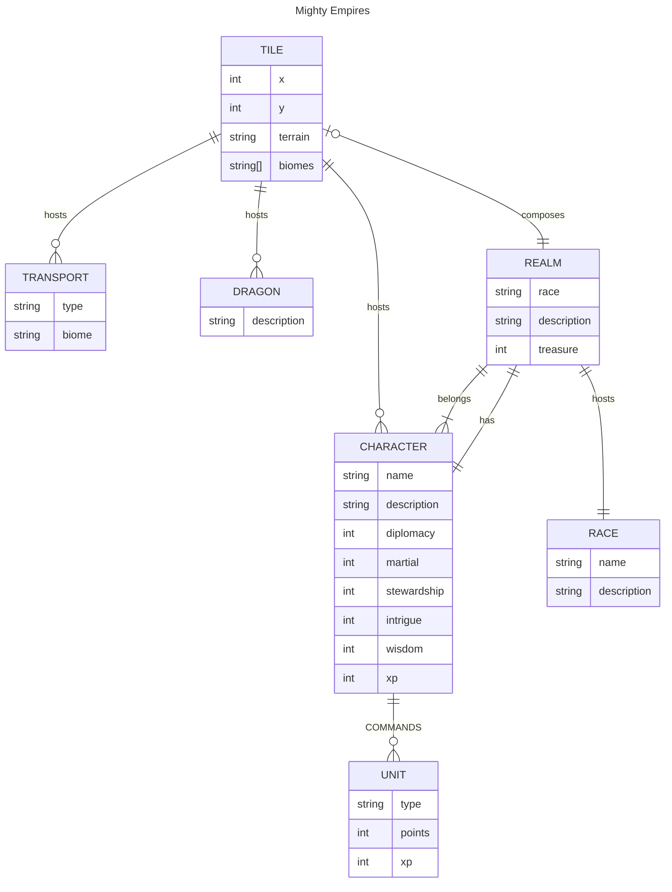

# Mighty Empires

## This project is under development

to start the porgram run cerate an network 

```mermaid
---
title: Mighty Empires
---
erDiagram

TILE ||--O{ TRANSPORT : hosts 
TILE ||--o{ DRAGON : hosts
TILE |O--|| REALM : composes
TILE {
    int x
    int y
    string terrain
    string[] biomes
}

CHARACTER }|--|| REALM: belongs
CHARACTER }O--|| TILE: hosts
CHARACTER {
    string name
    string description
    int diplomacy
    int martial
    int stewardship
    int intrigue
    int wisdom
    int xp
}


REALM ||--|| CHARACTER : has
REALM ||--|| RACE: hosts
REALM {
    string race
    string description
    int treasure
}


TRANSPORT{
    string type
    string biome
}

CHARACTER ||--o{ UNIT: COMMANDS

UNIT {
    string type
    int points
    int xp
}


DRAGON {
    string description
}

RACE {
    string name
    string description
}


```