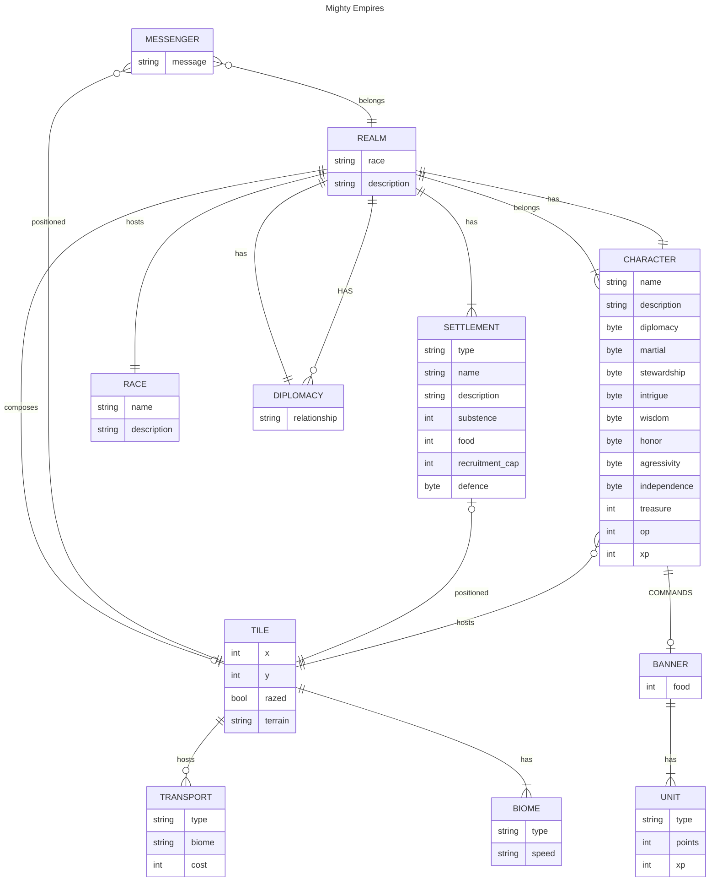

# Mighty Empires

## This project is under development

to start the porgram run cerate an network 
```docker network create mighty_network```

Then run the following commands
```docker-compose build``` and
```docker-compose up```

